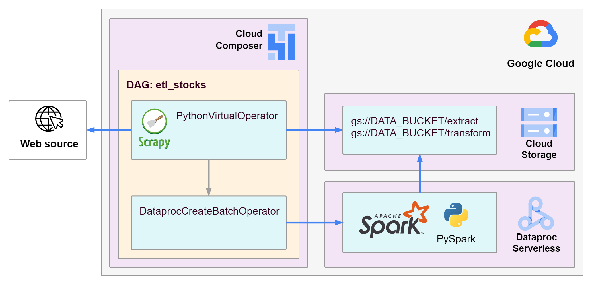

# ETL showcase on stocks data

ETL showcase demo pipeline for collecting stocks data from web sources. This pipeline extracts data by scraping web pages through Scrapy and transforms raw data to a clean format through a Spark job. I developed this pipeline as an Airflow DAG for running in Google Cloud by using Cloud Composer, Cloud Dataproc Serverless, and Cloud Storage; provisioned with Terraform.



# Cloud setup

Update scripts permissions:
```bash
chmod +x ./init-cloud-env.sh ./infrastructure/gcp/scripts/*.sh
```

Initialize cloud resources:
- If running from Cloud Shell:
    ```bash
    GCP_REGION=us-central1 RUN_ALL=true ./init-cloud-env.sh
    ```
- If running from other than Cloud Shell:
    ```bash
    # Set environment variables
    export GCP_PROJECT_ID=
    export GCP_REGION=us-central1

    # Log in:
    gcloud config set project $GCP_PROJECT_ID
    gcloud auth login
    gcloud auth application-default login

    # Run all: apply Terraform, update Composer env, upload Spark job files
    RUN_ALL=true ./init-cloud-env.sh
    ```
Notes:
- Annotate buckets URIs from Terraform outputs.
- Uploading DAGs will replace DAGs, but it won't delete old DAGs.
- DAGs module dependencies are uploaded to DAGs bucket location.

You can run individual scripts once Terraform has been applied at least once:
```bash
# Initialize and apply Terraform manifests
APPLY_TERRAFORM=true ./init-cloud-env.sh

# Update Composer variables based on `variables.json`
UPDATE_COMPOSER_VARIABLES=true ./init-cloud-env.sh

# Upload Composer DAGs
UPLOAD_COMPOSER_DAGS=true ./init-cloud-env.sh

# Upload Spark job app file and pyfiles to corresponding bucket
UPLOAD_SPARK_JOB=true ./init-cloud-env.sh
```

# Local setup
- All following steps consider root project directory as current working directory
- Installing `common/requirements.common_base.txt` is required only for defining `.py` script parameters through environment variables

Using `pip` + `venv`:
```bash
python3.8 -m venv venv
source venv/bin/activate
pip install --upgrade pip
pip install -r requirements.dev.txt -r common/requirements.common_base.txt
```

Using `conda`:
- if running Airflow locally in systems with SQLite library < 3.15.0, then follow instructions from [Airflow local setup troubleshooting](./infrastructure/local/airflow//README.md)
```bash
conda create -n etl-stocks python=3.8
conda activate etl-stocks
conda install --file requirements.dev.txt --file common/requirements.common_base.txt
```

Define `envvars` file:
- add `common` directory to `PYTHONPATH` along with each ETL stage directory:
```bash
AIRFLOW__CORE__DAGS_FOLDER={PWD}/infrastructure/local/airflow/dags
AIRFLOW__CORE__LOAD_EXAMPLES=False
AIRFLOW__WEBSERVER__WORKERS=2
AIRFLOW_VAR_EXTRACT_OUTPUT_DEST=${PWD}/outputs/extract
AIRFLOW_VAR_TRANSFORM_OUTPUT_DEST=${PWD}/outputs/transform
AIRFLOW_VAR_TRANSFORM_SPARK_APP=${PWD}/transform/transform_investing_spark.py
PYTHONPATH=${PWD}/common:${PWD}/extract:${PWD}/transform
```

Update environment variables:
```bash
set -a; source envvars; set +a;
```

Follow setup instructions in each ETL stage:
- [Extract README](./extract/README.md)
- [Transform README](./transform/README.md)

Run ETL with testing trigger:
- `test` commands do not update database: https://airflow.apache.org/docs/apache-airflow/stable/tutorial/fundamentals.html
- `EXECUTION_DATE` must be lower than current date as `test` command is based on `backfill`
```bash
EXECUTION_DATE=2000-01-01
airflow dags test $DAG_ID $EXECUTION_DATE
```

Run ETL with manual trigger:
- this requires Airflow to be running as standalone
```bash
DAG_ID=etl_stocks
airflow dags trigger $DAG_ID
```

Run Airflow standalone:
```bash
airflow standalone  # local development only, DON'T USE IN PRODUCTION
```
